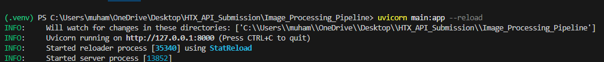
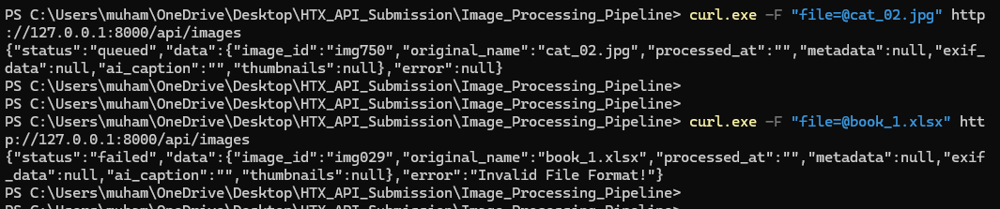
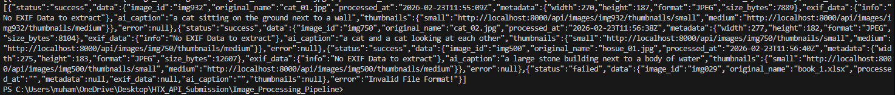
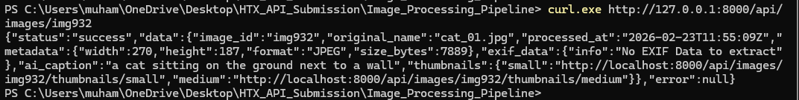
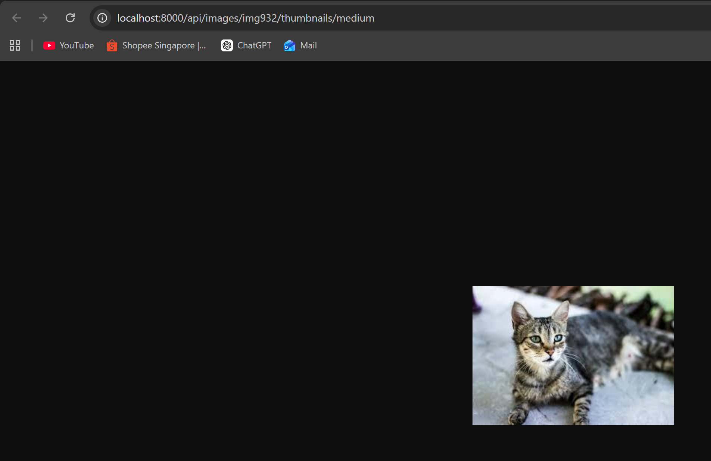
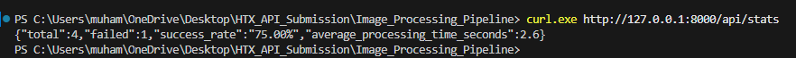
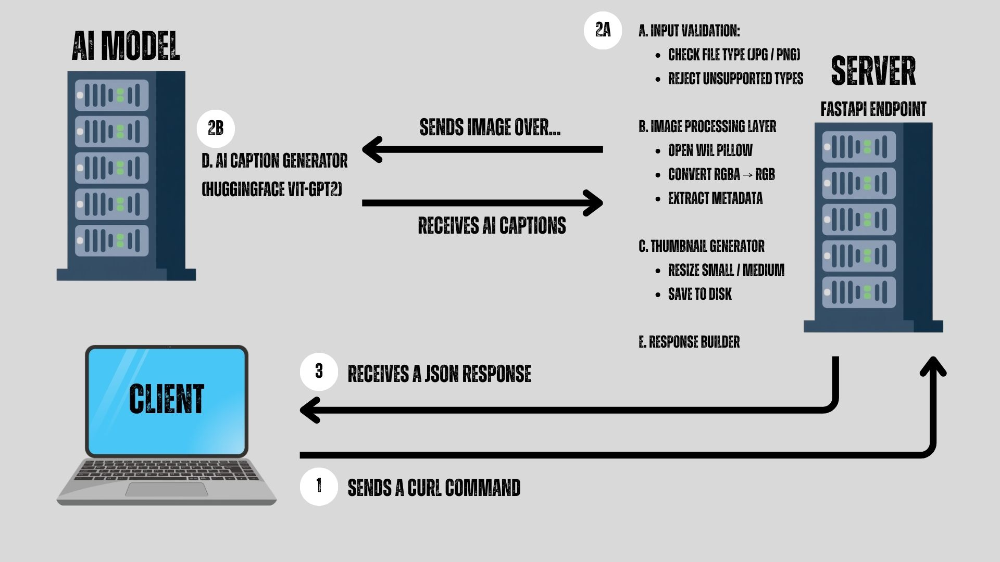

# HTX Digital Forensics Internship - Take Home Assessment

## Submission Details
**Name:** Muhammad Fizry Bin Ridzwan

## 1. Project Overview
This project implements a RESTful Image Processing Pipeline API as part of the Digital Forensics Internship – Software Engineering Assessment 

The system is designed to automatically process uploaded images, generate thumbnails, extract metadata, perform AI-based image captioning, and expose the processed results through structured API endpoints.

The API supports JPEG and PNG image uploads and performs the following automated processing steps:

    - Accepts image uploads via POST /api/images

    - Generates two thumbnail sizes (small and medium)

    - Extracts core metadata including dimensions, file format, file size, and timestamp

    - Generates an AI-based image caption using a publicly available model

    - Stores processing results in persistent storage

    - Provides structured JSON responses following the required response format

    - Exposes thumbnail images via dedicated retrieval endpoints

    - Tracks processing statistics including success rate and average processing time

The system follows RESTful API design principles and separates concerns between:

    - Image storage

    - Metadata extraction

    - Thumbnail generation

    - AI analysis

    - API response handling

    - Processing statistics tracking

Error handling is implemented to gracefully manage:

    - Unsupported file formats

    - Corrupted image files

    - Processing failures

    - AI inference errors

Processing logs are recorded using structured logging to support traceability and debugging. This implementation is designed to be modular, extensible, and production-oriented, with optional support for asynchronous processing and job queuing for improved scalability.

## 2. Installation Steps & Setup Guide
### A. Prerequisites:

Ensure the following software is installed:

- Python 3.10 or newer  
  https://www.python.org/downloads/

- Git  
  https://git-scm.com/downloads

(Optional but recommended)
- VSCode  
  https://code.visualstudio.com/

  Verify installation:

```bash
python --version
git --version
```

### B. Clone Repository

```bash
git clone https://github.com/FrostTechHub/Image_Processing_Pipeline.git
cd Image_Processing_Pipeline
```

*Alternatively, you may Download the Zip folder by clicking on the [<> Code] button

### C. Create Virtual Environment

Running Windows:

```bash
python -m venv .venv
```

In Powershell, activate the virtual envrionment by running the command:

```bash
.venv/Scripts/Activate
```

Should you encounter an execution policy error, run the following command:

```bash
Set-ExecutionPolicy -Scope Process -ExecutionPolicy Bypass
```

Now, try to activate the virtual environment again...

### D. Installing Dependencies

Run the following command within the virtual environment:

```bash
pip install -r requirements.txt
```

Otherwise, you may also install manually:

```bash
pip install fastapi uvicorn pillow torch torchvision transformers python-multipart
```
### D-1. Configuring HuggingFace Token

Should you have a HuggingFace Token, you may want to configure an environment variable so as to avoid rate limits when downloading the AI model:

1. Create an account at: https://huggingface.co/

2. Generate a token at: https://huggingface.co/settings/tokens

3. Set the environment variable (PowerShell):

```bash
$env:HF_TOKEN="your_token_here"
```
### E. Running the application

Start the FastAPI server:

```bash
uvicorn main:app --reload
```
You will see the following result:



<b>Take note of the IP Address and Port No.. You will need it later...</b>

### F. Ready to use

Refer to Section 4 - Sample Usage (i.e. How to run the code...) 

## 3. API Documentation

This API is built using FastAPI [FastAPI Tutorial Link](https://www.youtube.com/watch?v=iWS9ogMPOI0&pp=0gcJCaIKAYcqIYzv)<br>
For more information, you may refer to [FastAPI's Documentation Link](https://fastapi.tiangolo.com/#deploy-your-app-optional)<br>
For examples on how to run the code, refer to Section 4 of the README.md Doc :)

1. POST /api/images <br>
Accepts file uploads, and returns an image_id to the user for future references (as long as the server does not restart or shutdown in between). Additionally, a pre-failure message may be issued to the client should they upload a file that does not match the criteria (e.g. Not JPG or PNG file type)
<br>
2. GET /api/images<br>
Returns all processed images or in-processing images to the client in a JSON format.
<br>
3. GET /api/images/<image_id><br>
Returns information for only the specified image mentioned. Should a client enter an invalid image_id, an error message will be returned.
<br>
4. GET /api/images/<images_id>/<small or medium><br>
To be run in the web browser. Web browser should return the specified image and its respective size (depending on what the user specified). Will return an error message if the user requests for a invalid image_id or an invalid image size.
<br>
5. GET /api/stats<br>
Returns the statistics of all the images (e.g. total no. of files uploaded, no. of failed files, average time taken to process each file, etc.)
<br>

## 4. Sample Usage (i.e. How to run the code...)

Open up a new powershell tab or window:

1. Uploading a file.

Enter the IP Address and Port No. into the following command. Replace <file_name> and <file_extension> will the relevant info.
```bash
curl.exe -F "file=@<file_name>.<file_extension>" http://<ip_addr>:<port_no.>/api/images
```

<b>Expected Results:</b>


*Depending on the <file_extension> type, you may or may not get an error message.

2. Viewing all images

```bash
curl.exe http://<ip_addr>:<port_no.>/api/images
```

<b>Expected Results: </b>

*Take note of "image_id" as you will need it for when viewing specific images


3. Viewing a specific image

```bash
curl.exe http://<ip_addr>:<port_no.>/api/images/<image_id>
```

<b>Expected Results: </b>

*Take note of the URL link for when viewing the image at a small / medium scale...


4. Viewing a specific image at a small / medium scale

```bash
http://<ip_addr>:<port_no.>/api/images/<image_id>/<small / medium>
```
*You can either Cntrl + Click on the link, or you can copy and paste it into a web browser
**Choose between small or medium options only...

<b>Expected Results: </b>


5. Viewing of statistics

```bash
curl.exe http://<ip_addr>:<port_no.>/api/stats
```

<b>Expected Results: </b>


## 5. Processing Pipeline Explanation



## External Resources
### [Reading Resources]

https://curl.se/docs/tutorial.html

https://reqbin.com/req/python/c-dot4w5a2/curl-post-file#:~:text=Posting%20a%20File%20with%20Curl,Author:%20ReqBin

https://fastapi.tiangolo.com/#deploy-your-app-optional

https://fastapi.tiangolo.com/advanced/custom-response/#fileresponse

https://www.geeksforgeeks.org/python/python-pil-image-thumbnail-method/

https://www.geeksforgeeks.org/python/how-to-extract-image-metadata-in-python/

https://www.metadata2go.com/result#j=ba05b304-1100-4236-b977-2e103bd8abe0

https://www.w3schools.com/python/python_file_open.asp

https://www.w3schools.com/python/python_dictionaries_add.asp

https://huggingface.co/nlpconnect/vit-gpt2-image-captioning

https://huggingface.co/docs/transformers/en/installation

### [Youtube Tutorials]

https://www.youtube.com/watch?v=iWS9ogMPOI0&pp=0gcJCaIKAYcqIYzv

https://www.youtube.com/watch?v=8t6nbOH78lY

https://www.youtube.com/watch?v=okSrioyYnHw
